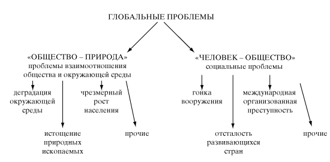

 # Культура и цивилизация

Цивилизация - от лат. "civitas", что означает "государство, сосредоточенное в городе" и "civillis", характеризующего "гражданина " как "городского жителя". Принято считать, что впервые слово "цивилизация" употребил маркиз де Виктор Рикети Мирабо в своём известном трактате "Друг законов" (1757). По его определению, "цивилизация есть смягчение нравов, учтивость, вежливость и знания, распространяемые для того, чтобы соблюдать правила приличий и чтобы эти правила играли роль законов общества".

## Многозначность понятия "цивилизация"

Несовпадения культуры и цивилизации представил в своей концепции Освальдь Шпенглер ("Закат Европы", 1918 - 1922), трактовавший цивилизацию как фазу заката культурно-исторического типа, его разложение. ***(Фазы Шпенглера)***

* Культура - совокупность духовных возможностей человеческого общества на той или иной ступени развития.

* Культура задает смыслы и цели общественного и личностного бытия.

* В культуре не реалистически, а символически выражена духовная жизнь.

* Культура есть явление индивидуальное и неповторимое. Культура имеет душу.

* Цивилизация - совокупность условий, необходимых для осуществления этих возможностей.

* Цивилизация обеспечивает формы социальной организации, тхенические средства, регламент человеческого поведения

* Цивилизация превращает идеальные планы культуры в реальные программы, в выполнение которых вовлекаются массы людей.

* Цивилизация есть явление общее и повсюду потворяющееся

* Цивилизация же имеет методы и орудия

* Цивилизация определяет место и роль всякого человека в культуре, устанавливает правила человеческого общежития, в которых находят более или менее адекватное выражение цели и идеалы культуры.

## Историческая динамика соотношения культуры и цивилизации

_(Схема проф. Моисея Самойловича кагана)_

* Первобытное состояние - доцивилизационный тип культуры

* Традиционная культура - цивилизация в культуре

* Индустриальная цивилизация - культура в цивилизации

* Постиндустриальное общество - отождествление культуры и цивилизации

## Типилогизация цивилизаций

Цивилизации различаются

* По господствующему типу хозяйственной деятельности: земледельческие, индустриальные или приморские, континентальные

* По принципу естественно-географической среды: открытые, закрытые (по взаимодействию с другими цивилизациями); интравертные, экстравертные (по направленности творческой энергии)

* По временному (тысячелетние цивилизационные цилы Э. Тоффлера: селькохозяйственная, индустриальная, постиндустриальная) или по религиозному принципу

Получила развитие концепция двух типов цивилизационного развития: традиционного и техногенного. Она исходит из признания, что тип цивилизации, её стратегия определяется культурой. Различия между западноевпроейской цивилизацией (техногенной) и восточной (традиционной) выросли из системы господствующих в них универсалий культуры, из различий в понимании человека, прирды, истины, власти, личности и пр.

## Основные черты культурных универсалий, составляющие основу западноевропейской культуры: 

* Представление о природе как поле приложения сил человека (сравнить с ценностной установкой восточной культуры на невмешательство в природу)

* Абсолютизация человеческой активности, призванной преобразовать мир (сравнить с восточной - к миру надо приспосабливаться, угадывать ритмы изменения мира)

* Технико-технологическая оптимальность развития техники и технологии вне их социокультурного измерения

* Быстрое изменение предметного мира; доминирование научной рациоеальности; ориентация на автономию личности, её прав и свободы и т.д.

___

## Глобальные проблемы

