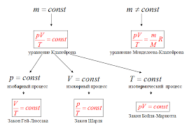

2. Разложение вектора ускорения на тангенциальную составляющую и нормальную:    
__Тангенциальная__ составляющая ускорения характеризует быстроту изменения величины (модуля) скорости. Оно всегда коллинеарно ей.   
__Нормальная__ составляющая ускорения характеризует быстроту изменения скорости по направлению. Нормальное ускорение всегда перпендикулярно скорости и направлению к центру по радиусу траектории, по которой движется тело.    

3. __Масса__ - скалярная величина, определяющая инерционные и гравитационные свойства тел.
__Сила__ - векторная величина, являющаяся мерой воздействия на тело других тел или полей, в результате которой тело деформируется или изменяет свою скорость.   
__Ускорение__ - векторная величина, определяющая быстроту изменения скорости.  
__Импульс__ - векторная величина, являющаяся мерой механического движения тела.  
__Первый закон Ньютона__ - существуют такие системы отсчёта, называемые инерциальными, в которых тела движутся равномерно и прямолинейно, если на них не действуют никакие силы или их действие скомпенсировано.    
__Второй закон Ньютона__ - ускорение тела (точки) в инерциальной системе отсчёта прямо пропорционально приложенной к нему силе и обратно пропорционально массе.     
__Третий закон Ньютона__ - два тела воздействуют друг на друга с силами, противоположными по направлению, но равными по модулю.

4. __Консервативные силы__ - потенциальные силы, работа которых не зависит от траектории, а определяется только начальным и конечным положениями тела. (Примеры: сила тяжести, сила упругости, гравитационная сила.)  
__Неконсервативные силы__ - силы, работа которых зависит от траектории. (Примеры: силы трения и сопротивления.)

5. __Кинетическая энергия__ - энергия движения тела, равная половине произведения массы тела на квадрат его скорости.   
__Потенциальная энергия__ - энергия, зависящая от положения тел и связанная с их взаимодействием.

6. __Импульс тела__ - векторная величина, равная произведению массы тела на его скорость и имеющая направление скорости.     
__Закон сохранения импульса__ - в замкнутой системе векторная сумма импульсов тел не меняется при любых движениях и взаимодействиях тел между собой. (Пример: при стрельбе из пушки возникает отдача: снаряд летит вперёд, а само орудие откатывается назад.)

7. __Момент инерции матереиальной точки__ - произведение массы на квадрат расстояния от материальной точки до оси вращения:     
I = m·r²  
__Теорема Штейнера__ - момент инерции тела относительно произвольной оси равен сумме момента инерции этого тела относительно параллельной оси, проведённой через центр масс тела и произведению массы тела на квадрат расстояний между осями:  
I = I₀ + md²    
__Вычисление моментов инерции тел правильной геометрической формы__:    
* * Однородный тонкий стержень длиной l и массой m: ml²/12  
* * Кольцо, полый цилиндр: mr²
* * Диск: mr²/2
* * Шар: 2/5mR²

8. __Момент силы относительно оси вращения__ - скалярная величина, равная проекции на эту ось вектора момента силы, определённого относительно любой точки на оси.  
 - закон динамики вращательного движения.

9. __Кинетическая энергия вращательного движения__ - энергия тела, связанная с его вращением.    

10. __Момент импульса материальной точки относительно точки и оси вращения__ - величина, равная проекции на эту ось вектора момента импульса, определенного относительно произвольной точки O данной оси z.     
I = mrv     
__Закон сохранения момента импульса__: суммарный момент импульса относительно любой неподвижной точки для замкнутой системы остается постоянным со временем.

11. __Закон сохранения энергии__: энергия не возникает и не исчезает, она может превращаться из одного вида в другой, а также передаваться от одного тела к другому.

12. __Сравнение основных формул вращательного и поступательного движений__:

13. __Уравнение состояния идеального газа__:    
  

14. __Теплопередача__ — физический процесс передачи тепловой энергии от более горячего тела к менее горячему.   
__Количество теплоты__ – это физическая величина, показывающая, какая энергия передана телу в результате теплообмена.   
Q = c m ( t 2 − t 1 )   
__Молярная теплоёмкость__ — количество теплоты, которое надо подвести к телу, чтобы изменить температуру 1 моль вещества на 1 градус Цельсия.   
__Удельная теплоемкость__ — количество теплоты, которое надо подвести к телу, чтобы изменить температуру 1 кг вещества на 1 градус Цельсия.     
 - число степеней свободы газа.

15. __Число степеней свободы__ – это число независимых переменных, определяющих положение системы в пространстве.   
__U =​ 2/3⋅pV__ - внутренняя энергия идеального газа

16. __Первое начало термодинамики__ - для любого процесса с газом справедлив первый закон термодинамики (первое начало термодинамики):

__Изопроцессы__:    

17.